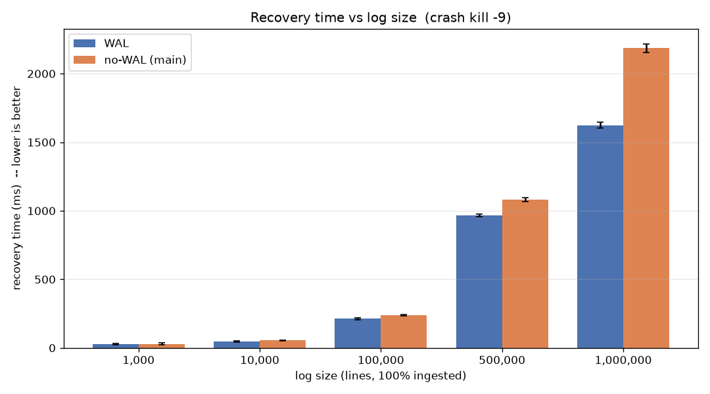
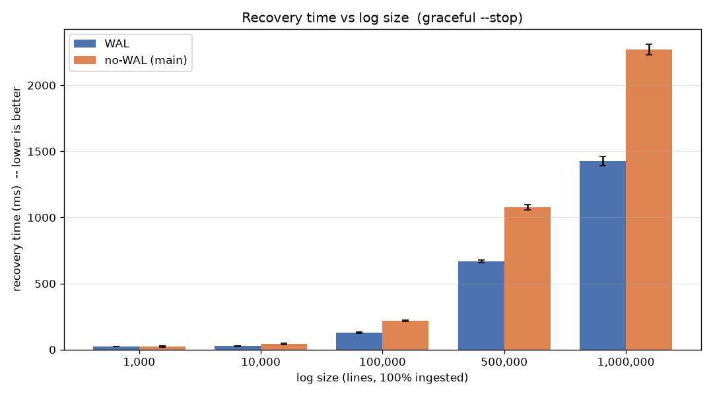

# WAL Recovery Performance vs. Baseline (No WAL)

Generated by `scripts/analyze.py`. Treatment = `feature/wal`, Control = `main` (no persistence). Dependent variable: recovery time (daemon start → index fully queryable), measured by polling `vigil "| count"` until it equals the ingested line count.

## Results table

One row per cell. `Δ` = no-WAL mean − WAL mean (positive = WAL faster). `speedup` = no-WAL / WAL. Cells with p > 0.05 are flagged **inconclusive**.

| size | pct | type | WAL ms (±95% CI) | no-WAL ms (±95% CI) | Δ ms | speedup | p | Cohen's d | verdict |
|---|---|---|---|---|---|---|---|---|---|
| 1,000 | 10% | kill | 16.7 [12.5, 20.8] | 19.9 [13.6, 26.1] | 3.2 | 1.19× | 0.3514 | -0.43 | ⚪ inconclusive |
| 1,000 | 50% | kill | 29.6 [27.6, 31.6] | 26.5 [22.4, 30.7] | -3.1 | 0.90× | 0.1515 | 0.68 | ⚪ inconclusive |
| 1,000 | 100% | kill | 26.3 [22.1, 30.5] | 30.0 [22.8, 37.1] | 3.7 | 1.14× | 0.3331 | -0.45 | ⚪ inconclusive |
| 10,000 | 10% | kill | 33.0 [26.4, 39.5] | 24.2 [18.1, 30.3] | -8.7 | 0.73× | 0.0404 | 0.99 | 🟥 WAL slower |
| 10,000 | 50% | kill | 38.4 [36.1, 40.7] | 39.3 [33.9, 44.8] | 0.9 | 1.02× | 0.7239 | -0.16 | ⚪ inconclusive |
| 10,000 | 100% | kill | 46.5 [42.7, 50.4] | 54.8 [51.2, 58.5] | 8.3 | 1.18× | 0.0023 | -1.58 | ✅ WAL faster |
| 100,000 | 10% | kill | 45.2 [41.3, 49.2] | 57.0 [49.0, 65.0] | 11.8 | 1.26× | 0.0107 | -1.33 | ✅ WAL faster |
| 100,000 | 50% | kill | 116.8 [110.4, 123.2] | 136.2 [133.9, 138.6] | 19.4 | 1.17× | 0.0000 | -2.88 | ✅ WAL faster |
| 100,000 | 100% | kill | 212.9 [204.6, 221.2] | 238.2 [232.6, 243.9] | 25.4 | 1.12× | 0.0000 | -2.55 | ✅ WAL faster |
| 500,000 | 10% | kill | 123.4 [120.3, 126.4] | 134.7 [129.8, 139.6] | 11.3 | 1.09× | 0.0005 | -1.98 | ✅ WAL faster |
| 500,000 | 50% | kill | 489.7 [482.0, 497.4] | 542.8 [534.0, 551.5] | 53.1 | 1.11× | 0.0000 | -4.61 | ✅ WAL faster |
| 500,000 | 100% | kill | 966.9 [957.8, 975.9] | 1080.1 [1065.0, 1095.1] | 113.2 | 1.12× | 0.0000 | -6.53 | ✅ WAL faster |
| 1,000,000 | 10% | kill | 213.4 [205.1, 221.8] | 232.0 [228.6, 235.5] | 18.6 | 1.09× | 0.0005 | -2.09 | ✅ WAL faster |
| 1,000,000 | 50% | kill | 960.1 [949.3, 971.0] | 1068.7 [1055.1, 1082.4] | 108.6 | 1.11× | 0.0000 | -6.32 | ✅ WAL faster |
| 1,000,000 | 100% | kill | 1623.0 [1601.2, 1644.8] | 2186.9 [2156.4, 2217.5] | 563.9 | 1.35× | 0.0000 | -15.21 | ✅ WAL faster |
| 1,000 | 10% | stop | 17.9 [11.4, 24.4] | 13.2 [8.3, 18.2] | -4.7 | 0.74× | 0.2143 | 0.58 | ⚪ inconclusive |
| 1,000 | 50% | stop | 21.5 [17.9, 25.1] | 25.7 [17.5, 33.9] | 4.2 | 1.20× | 0.3082 | -0.48 | ⚪ inconclusive |
| 1,000 | 100% | stop | 23.9 [23.0, 24.8] | 22.9 [16.8, 29.0] | -1.0 | 0.96× | 0.7319 | 0.16 | ⚪ inconclusive |
| 10,000 | 10% | stop | 24.1 [17.9, 30.3] | 22.4 [20.7, 24.1] | -1.7 | 0.93× | 0.5629 | 0.27 | ⚪ inconclusive |
| 10,000 | 50% | stop | 25.5 [20.2, 30.8] | 29.1 [26.3, 31.9] | 3.6 | 1.14× | 0.1940 | -0.61 | ⚪ inconclusive |
| 10,000 | 100% | stop | 26.5 [23.5, 29.4] | 42.6 [37.9, 47.3] | 16.1 | 1.61× | 0.0000 | -2.92 | ✅ WAL faster |
| 100,000 | 10% | stop | 25.8 [22.5, 29.1] | 46.4 [43.5, 49.3] | 20.6 | 1.80× | 0.0000 | -4.70 | ✅ WAL faster |
| 100,000 | 50% | stop | 65.7 [64.2, 67.3] | 111.7 [108.1, 115.4] | 46.0 | 1.70× | 0.0000 | -11.74 | ✅ WAL faster |
| 100,000 | 100% | stop | 126.5 [121.6, 131.3] | 220.0 [215.4, 224.5] | 93.5 | 1.74× | 0.0000 | -14.29 | ✅ WAL faster |
| 500,000 | 10% | stop | 68.6 [66.3, 70.8] | 120.5 [117.2, 123.7] | 51.9 | 1.76× | 0.0000 | -13.27 | ✅ WAL faster |
| 500,000 | 50% | stop | 321.5 [315.8, 327.1] | 536.4 [515.6, 557.3] | 215.0 | 1.67× | 0.0000 | -10.07 | ✅ WAL faster |
| 500,000 | 100% | stop | 667.9 [655.9, 679.9] | 1077.2 [1055.1, 1099.3] | 409.3 | 1.61× | 0.0000 | -16.48 | ✅ WAL faster |
| 1,000,000 | 10% | stop | 127.4 [125.6, 129.1] | 207.2 [204.8, 209.6] | 79.8 | 1.63× | 0.0000 | -26.85 | ✅ WAL faster |
| 1,000,000 | 50% | stop | 668.4 [656.6, 680.3] | 1073.5 [1048.0, 1099.1] | 405.1 | 1.61× | 0.0000 | -14.56 | ✅ WAL faster |
| 1,000,000 | 100% | stop | 1427.8 [1392.1, 1463.5] | 2270.0 [2228.3, 2311.6] | 842.1 | 1.59× | 0.0000 | -15.53 | ✅ WAL faster |

## Plots

**Crash (kill -9)** — 100% ingested:

**Graceful (--stop)** — 100% ingested:

## Raw data

- Raw timings: [`raw.csv`](raw.csv)
- Per-cell stats: [`results.csv`](results.csv)
